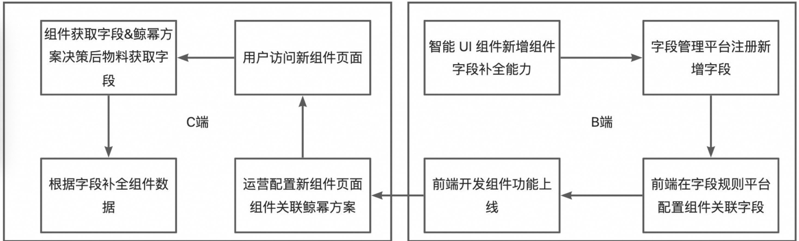
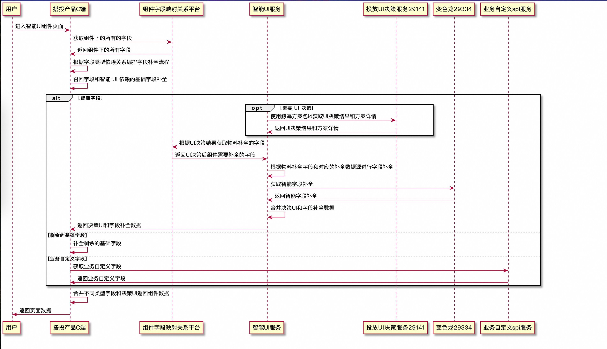

* content
{:toc}

# 背景
在搭建投放领域,页面通常是通过可复用的组件搭建出来,此时单纯的智能UI决策能力,有以下局限性
* UI决策结果和决策结果所需的数据是割裂的 无法联动管理
* 只有UI的智能 没有UI对应数据的智能能力
* 接入方的成本较高,需自行处理UI决策后所需数据的补全

在这个背景下,建立了本地生活搭投智能UI服务(33416),其包含了数据补全&UI决策的能力,可联动两边结果进行处理.

举个栗子 我们有个组件 其有两种UI样式 一种UI有到手价展示 另一个没有.在搭投智能UI服务里,如果UI决策后是没有到手价的UI,在数据补全时,就不会咨询到手价的数据.节省了查询的耗时以及返回的数据量.
# 能力
搭投智能UI服务具有三种可扩展的智能能力
## UI智能
搭投智能UI通过不同场景的UI决策算法(可替换)决策到组件对应的UI物料,通过物料获取对应所需补全的字段,数据补全后返回UI物料样式数据和物料样式对应所需的内容数据
## 内容智能
搭投智能UI通过接入不同的内容智能数据源实现对于内容数据的智能优选,比如常见的店铺推荐语,对于单纯的智能UI服务来说 决策的是店铺推荐语这个样式是否出,也就是字段的key.对于内容智能来说,其决定的是这个key下面多个value的优选.如店铺推荐语有 "味道很不错","近30日1500人复购".其决定的是出哪几条
## 接入智能
在实际的开发过程中,很多接入方由于历史原因和链路问题,对返回的内容数据格式和key有自定义的诉求.搭投智能UI自定义了一套字段数据协议,可以对相同的数据源返回的字段做对应的格式与key转换,极大减少了接入成本
# 设计&实现
## 领域模型
搭投智能UI维护了字段的模型,字段分为字段模板(定义了字段如何从数据源获取).字段实例,在物料、组件或其他场景绑定某个字段后生成(定义了字段在这个场景下的展示)

![](https://intranetproxy.alipay.com/skylark/lark/__puml/f2cc567ca5649a9f215d40d06666c243.svg#lake_card_v2=eyJ0eXBlIjoicHVtbCIsImNvZGUiOiJAc3RhcnR1bWxcbm5hbWVzcGFjZSDmkK3lu7rln58gI0RERERERCB7XG5cdGNsYXNzIOe7hOS7tiB7XG5cdOe7hOS7tklEXG5cdC4uXG5cdOS4muWKoeexu-Wei1xuXHTlrZfmrrVcblx05a2X5q616YWN572uXG5cdF9fXG4gIOS_neWtmOe7hOS7tigpXG5cdOafpeivoue7hOS7tigpXG59XG59XG5cblxubmFtZXNwYWNlIOaKleaUvuWfnyAjREREREREIHtcblx0Y2xhc3Mg5a2X5q61IHtcblx05a2X5q61SURcblx0Li5cblx05a2X5q61Y29kZVxuXHTkvp3otZblrZfmrrXpm4Zcblx05p2l5rqQ57G75Z6LKOWPrOWbniDmmbrog73ooaXlhagg5Z-656GA6KGl5YWoKVxuXHTkuJrliqHnsbvlnotcblx05Lia5Yqh57G75Z6L5Yir5ZCNXG5cdF9fXG4gIOS_neWtmOWtl-autSgpXG5cdOafpeivouWtl-autSgpXG59XG5cdGNsYXNzIOS4muWKoeexu-Wei-Wtl-autemFjee9riB7XG5cdOinhOWImUlEXG5cdC4uXG5cdOWtl-autUlEXG5cdOS4muWKoeexu-Wei1xuXHTlhbPogZRJRCjnu4Tku7blkI3miJbnianmlplJRClcblx05YWz6IGU57G75Z6LKOe7hOS7tuaIlueJqeaWmSlcblx05a2X5q616YWN572uKOaYr-WQpuWPr-ingSlcblx0X19cbiAg5L-d5a2Y5a2X5q616KeE5YiZKClcblx05p-l6K-i5a2X5q616KeE5YiZKClcbn1cbiAg5a2X5q61IFwiMVwiIDwtLT4gXCJuXCIg5Lia5Yqh57G75Z6L5a2X5q616YWN572uXG5cdOaQreW7uuWfny7nu4Tku7YgXCIxXCIgPC0tPiBcIm5cIiDkuJrliqHnsbvlnovlrZfmrrXphY3nva5cbn1cblxuQGVuZHVtbFxuIiwidXJsIjoiaHR0cHM6Ly9pbnRyYW5ldHByb3h5LmFsaXBheS5jb20vc2t5bGFyay9sYXJrL19fcHVtbC9mMmNjNTY3Y2E1NjQ5YTlmMjE1ZDQwZDA2NjY2YzI0My5zdmciLCJpZCI6IlBJNFI2IiwibWFyZ2luIjp7InRvcCI6dHJ1ZSwiYm90dG9tIjp0cnVlfSwiY2FyZCI6ImRpYWdyYW0ifQ==)

## 字段管理
字段管理后台提供字段的生命周期维护,目前有两种数据类型字段的注册,智能 UI 字段  和基础字段
### 基础字段
基础字段由召回器产生的所有字段加上业务应用自行补全的字段,字段和字段数据源的映射由业务维护
### 智能 UI 字段
智能 UI 字段是由智能 UI 服务提供的补全字段  智能 UI 字段和字段数据源由智能 UI 服务维护映射关系

### 字段配置协议
如 deliveryMode 配送模式字段模板定义
```json
[
    {
        "code": "deliveryMode",
        "bizType": "ele_dish_item",
        "sourceType": "IntelligentFill",
        "alias": "shop:delivery_mode:data:raw"
    }
]
```
code 为默认字段key

bizType 字段所属的业务类型

sourceType 字段类型 IntelligentFill为智能补全字段

alias 字段在数据源返回的数据中的位置 其中后缀:raw 标识不做处理(默认返回string格式)数据源数据原样返回

### 智能UI组件创建使用流程


### C端处理流程图
